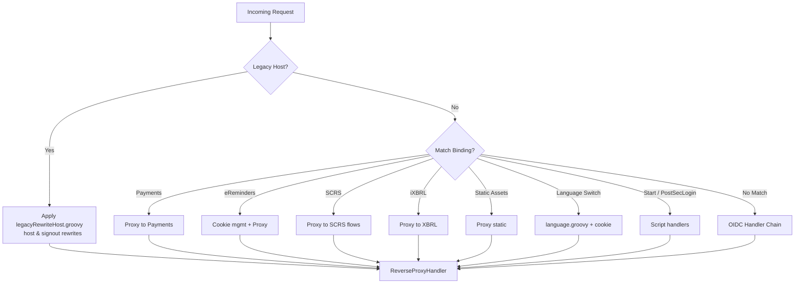
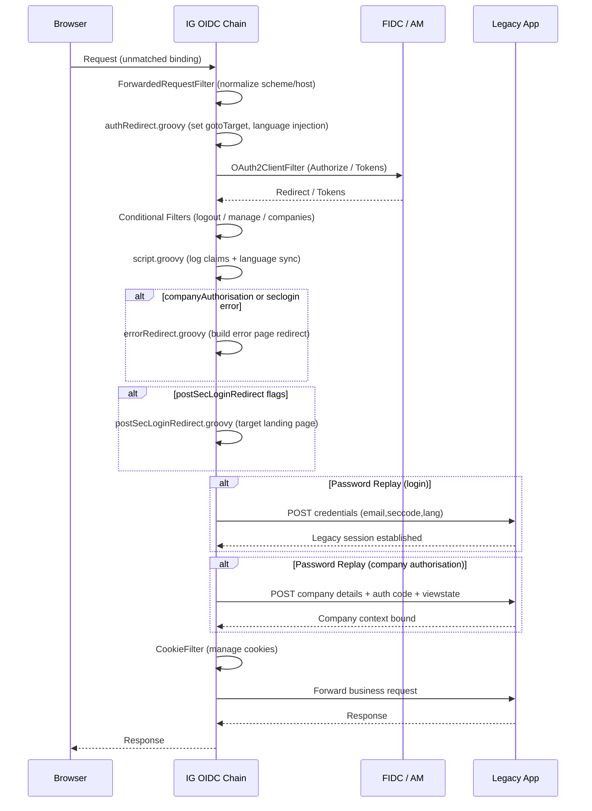
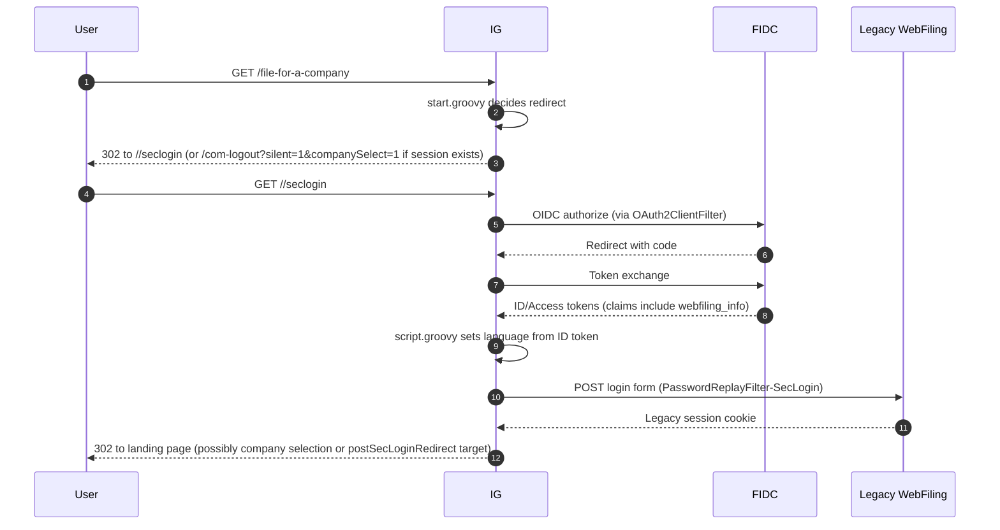
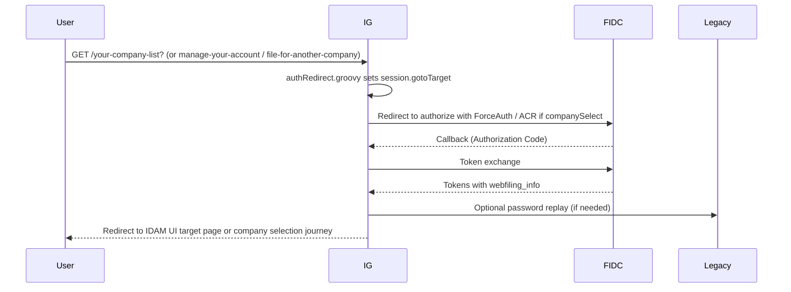
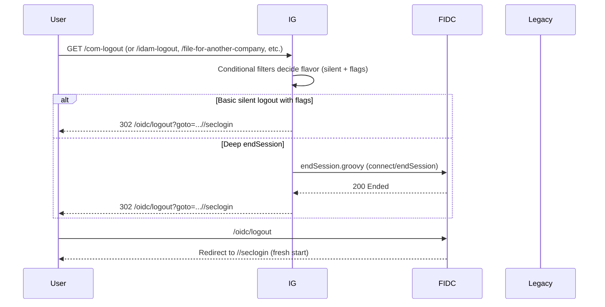
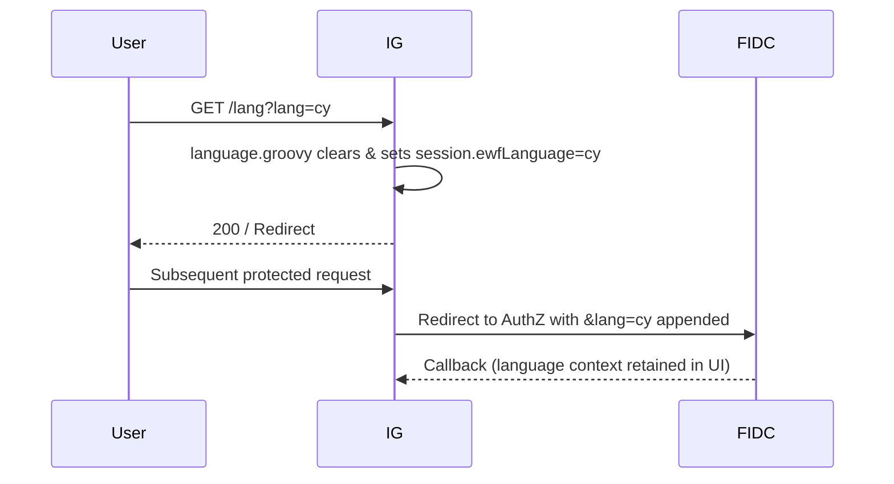
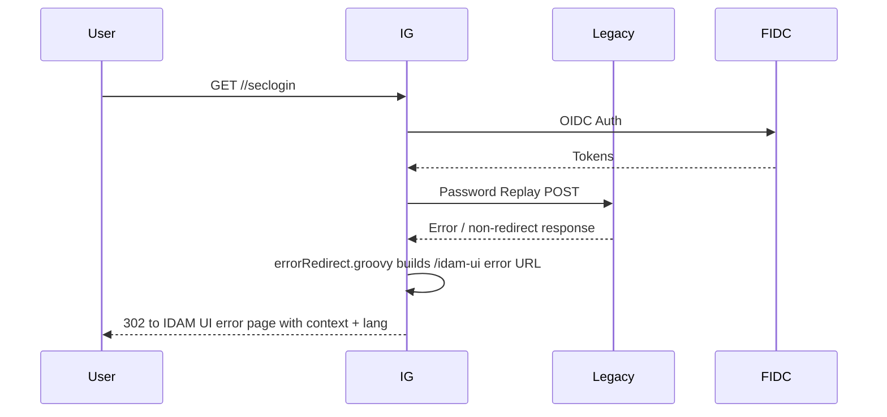

# WebFiling Identity Gateway (ForgeRock IG) – Functional Architecture Overview

This document provides a conceptual and flow-centric overview of the WebFiling ForgeRock Identity Gateway (IG) configuration. It complements the deeper functional and URL coverage documents by adding architectural context and visual sequence / decision diagrams.

---
## 1. Purpose & Positioning
The WebFiling IG instance sits between:
- Users (browser clients)
- ForgeRock Identity Cloud (FIDC) / AM (OIDC provider & journeys)
- Legacy WebFiling application (expects form-based auth and company-specific session state)
- Auxiliary upstreams (Payments, SCRS incorporation, iXBRL validation, static assets)

It mediates authentication, session bridging, routing, language propagation, company selection flows, and unified logout semantics across modern and legacy boundaries.

---
## 2. Core Responsibilities
| Responsibility | Description |
|----------------|-------------|
| Routing & Dispatch | Matches request path/query/cookies/headers to functional bindings (payments, incorporation, static assets, eReminders, etc.). |
| Identity Orchestration | Shapes OIDC authorize redirects with journey, realm, ACR, ForceAuth, goto, and language attributes. |
| Session Bridging | Replays credentials & company auth data from OIDC ID token claims into legacy form POSTs to bootstrap legacy application sessions. |
| Language Persistence | Maintains `ewfLanguage` in IG session, propagating it into redirects and UI endpoints. |
| Company Context Selection | Uses query flags (`companySelect`, `manageAccount`, `yourCompanies`) to direct the user into specific IDAM UI flows or forced re-authentication. |
| Unified Logout | Collapses multiple triggers (`com-logout`, `idam-logout`, company selection changes) into structured local + OIDC + back-channel endSession termination. |
| Legacy Compatibility | Rewrites hostnames/paths for legacy domains and adjusts signout endpoints for consistency. |
| Error Handling | Redirects failed replay / auth flows to contextual IDAM UI error pages with language and company metadata. |
| Observability | Logs OpenID claims, captures requests/responses, and applies timing decorators (subject to PII considerations). |

---
## 3. High-Level Component Diagram
```mermaid
flowchart LR
    %% Simplified node labels to avoid newline parse errors on GitHub
    Browser([Browser Client])
    IG([WebFiling IG (Routing + Filters + Scripts)])
    Legacy([Legacy WebFiling (Form Auth & Company Data)])
    FIDC([ForgeRock Identity Cloud (OIDC Journeys)])
    Payments([Payments Service])
    SCRS([SCRS Incorporation])
    XBRL([iXBRL Validator])
    Static([Static Assets])

    Browser <--> IG
    IG <--> FIDC
    IG <--> Legacy
    IG --> Payments
    IG --> SCRS
    IG --> XBRL
    IG --> Static
```

---
## 4. Request Classification & Dispatch Logic


---
## 5. OIDC Handler Chain – Filter Sequence


---
## 6. Secure Login & Password Replay Flow


---
## 7. Company Selection / Manage Account / Your Companies


---
## 8. Unified Logout Flow


---
## 9. Language Propagation Flow


Language fallback: If `/lang` not invoked, `script.groovy` populates `ewfLanguage` from ID token claim when first OIDC journey completes or when returning from IDAM UI referer.

---
## 10. Error Handling Flow (Company Authorisation / Secure Login)


Special case: Auth code request completion triggers forced error page messaging to avoid inadvertent reuse of stale company session state.

---
## 11. Session Model
| Key | Meaning | Lifecycle |
|-----|---------|-----------|
| `oauth2:https://&{ig.host}:443/oidc` | OIDC registration, tokens, attributes | Created by `OAuth2ClientFilter` |
| `gotoTarget` | Post-auth/post-logout navigation directive | Set by `authRedirect.groovy`, cleared after use |
| `ewfLanguage` | User language preference | Set by `/lang` or `script.groovy` from ID token |

---
## 12. Critical Scripts & Their Roles
| Script | Role |
|--------|------|
| `authRedirect.groovy` | Shapes authorize redirect & handles journey branching and language injection. |
| `start.groovy` | Entry-point logic for `/file-for-a-company`, selects proper initial redirect. |
| `postSecLoginRedirect.groovy` | Avoids double password replay; steers user to specific landing pages (auth code / recent filings). |
| `legacyRewriteHost.groovy` | Host prefix rewrites & signout mapping for legacy domain continuity. |
| `language.groovy` | Explicit language switch & session persistence. |
| `script.groovy` | Logging & language initialization from ID token claims. |
| `endSession.groovy` | Back-channel OIDC end-session call to FIDC. |
| `errorRedirect.groovy` | Predictable error page redirection with contextual query composition. |

---
## 13. Edge Cases & Mitigations
| Edge Case | Current Handling | Potential Improvement |
|-----------|------------------|----------------------|
| Malformed iXBRL route condition | May not match `/xbrl` or `/xbrl_info` | Fix expression, add test |
| Multiple leading slashes (`//seclogin`) | Conditions duplicated | Normalize path once upstream |
| Password replay of sensitive claims | ID token contains password/auth code | Replace with server-side session bootstrap API |
| Insecure TLS trust (`TrustAllManager`, `ALLOW_ALL`) | Simplifies connectivity | Proper trust store & hostname verification |
| Over-capture of logs (claims + entity) | PII risk | Structured logging & redaction policies |

---
## 14. Migration Considerations (Removing IG)
| Functionality | Replace With |
|---------------|-------------|
| OIDC Journey Shaping | Application-side OIDC library + middleware building auth URLs (includes ForceAuth, acr_values, goto, lang). |
| Password Replay | Secure backend service performing credential exchange; do not expose raw password in tokens. |
| Company Selection Logic | Dedicated UI endpoints controlling re-auth flows instead of session `gotoTarget`. |
| Legacy Host Rewrites | DNS / reverse proxy rules or application-level redirect service. |
| Language Session & Propagation | Store language in application session/cookie; attach to OIDC requests via query or `ui_locales`. |
| Unified Logout | Composite logout handler invoking local cleanup + OIDC RP logout + post-logout redirect. |
| Error Redirect Consistency | Central error controller constructing context-aware pages. |

---
## 15. Summary
The WebFiling IG instance is an orchestration gateway enabling a hybrid identity model: modern OIDC layered over a form-auth legacy system, enriched by language, company selection, and conditional journeys. Its removal requires deliberate re-implementation of: redirect shaping, password replay replacement, unified logout, language persistence, and nuanced routing decisions currently expressed as IG bindings and conditional filters.

---
## 16. Suggested Next Docs
1. **Migration Blueprint** – Stepwise replacement strategy by responsibility.
2. **Security Hardening Plan** – Address TLS, password replay removal, logging minimization.
3. **Routing Decision Matrix** – Map each binding to new service/module owner.
4. **Claim Minimization Strategy** – Redesign token contents for least privilege.

---
*End of Architecture Overview.*
