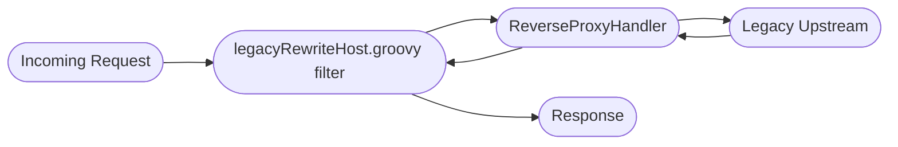
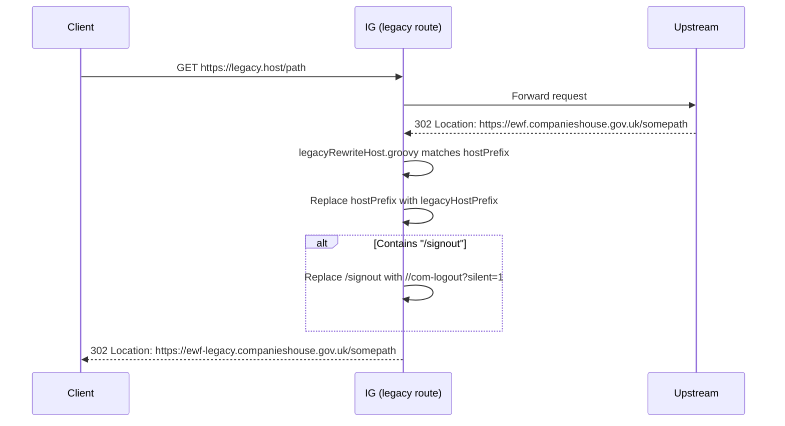
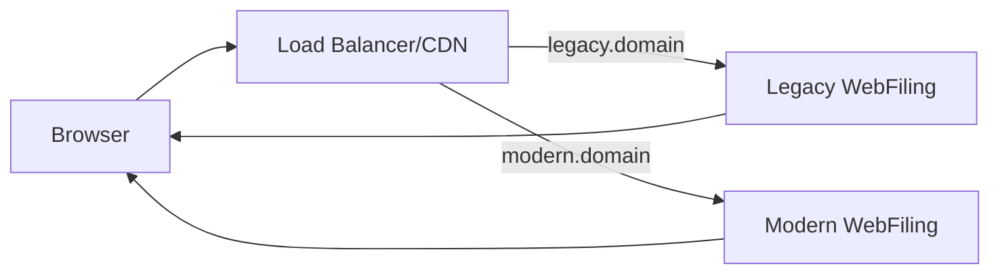

# Legacy Host Route Analysis – WebFiling ForgeRock IG

This document provides a comprehensive, implementation‑level explanation of the "Legacy Web Filing" route defined in `config/routes/01-legacy.json` and the associated Groovy script `legacyRewriteHost.groovy`. It covers functional behavior, redirect transformation logic, interaction patterns, edge cases, risks, and migration considerations when decommissioning the Identity Gateway (IG).

---
## 1. Source Artifacts
| File | Role |
|------|------|
| `config/routes/01-legacy.json` | Route definition for legacy host requests. Applies a filter chain and proxies upstream via `ReverseProxyHandler`. |
| `scripts/groovy/legacyRewriteHost.groovy` | Scriptable filter altering redirect `Location` headers and certain inbound URIs for legacy compatibility. |

---
## 2. Activation Condition
The route is selected when:
```
${request.uri.host == '&{application.legacy.host}'}
```
All requests whose Host header (or URI host) matches the configured legacy hostname are processed by this route. This effectively partitions traffic by domain—no path inspection is done at selection time.

---
## 3. Execution Chain Overview

Key point: `legacyRewriteHost.groovy` runs both before sending response (post‑proxy) and after redirects are received, because it wraps `next.handle(...)` and then transforms the response object.

---
## 4. Reverse Proxy Handler Configuration (Security Observations)
Configured with:
- TLS options: `TrustAllManager` + `hostnameVerifier: ALLOW_ALL` (disables certificate and hostname validation; fine for isolated internal networks but risky otherwise).
- Request/response capture enabled (potential for logging sensitive redirect locations or session identifiers).

---
## 5. Legacy Rewrite Script – Detailed Logic
### 5.1 Variables (Args)
| Arg | Meaning |
|-----|---------|
| `hostPrefix` | Prefix representing the modern application host: `ewf`. |
| `legacyHostPrefix` | Prefix for legacy domain variant: `ewf-legacy`. |
| `applicationHost` | Full modern host: `ewf.companieshouse.gov.uk`. |
| `applicationLegacyHost` | Full legacy host: `ewf-legacy.companieshouse.gov.uk`. |

These allow dynamic substitution without hardcoding hostnames inside the script.

### 5.2 Processing Steps (High-Level)
1. Capture request/response contextual data for logging.
2. If the **response is a redirection (3xx)** and `Location` header matches pattern:
   - `^https://${hostPrefix}.*` → Consider rewriting.
3. If the `Location` does **not** already contain the `legacyHostPrefix`, replace all occurrences of `hostPrefix` with `legacyHostPrefix` to push the user into the legacy domain space for subsequent navigation.
4. If rewritten `Location` contains `/signout`, replace segment `/signout` with `//com-logout?silent=1` (unified logout path semantics).
5. Else if **the request URI** contains `applicationHost` and `/file-for-another-company`:
   - Replace `applicationHost` with `applicationLegacyHost`.
   - Replace `/file-for-another-company` with `/runpage?page=companyAuthorisation` (legacy page path).
6. If any transformation occurred (`newUri` non-empty): set response status to `302 FOUND`, remove existing `Location`, add transformed `Location`.
7. Log final state and exit.

### 5.3 Sequence Diagram – Redirect Rewriting


### 5.4 Decision Table
| Condition | Action | Example Before | Example After |
|-----------|--------|----------------|---------------|
| Response is redirect & Location matches `^https://${hostPrefix}` & Location lacks `legacyHostPrefix.` | Host prefix substitution | `https://ewf.companieshouse.gov.uk/login` | `https://ewf-legacy.companieshouse.gov.uk/login` |
| Rewritten URI contains `/signout` | Replace `/signout` with `//com-logout?silent=1` | `https://ewf.companieshouse.gov.uk/signout` | `https://ewf-legacy.companieshouse.gov.uk//com-logout?silent=1` |
| Request URI contains `applicationHost` & `/file-for-another-company` | Host substitution + path transform | `https://ewf.companieshouse.gov.uk/file-for-another-company?x` | `https://ewf-legacy.companieshouse.gov.uk/runpage?page=companyAuthorisation&x` |
| None matched | Passthrough | N/A | Original stays |

### 5.5 Notable Implementation Details
- Uses regex `==~` for `Location` matching (Groovy pattern match operator). Precise anchor ensures only redirects to the modern host are changed.
- Checks presence of legacy prefix to avoid double rewriting loops.
- Adds *double slash* `//com-logout` path intentionally (alignment with other IG handlers expecting that variant). Multi-slash normalization is left to downstream or consistent IG processing.
- Performs *both* host and path transformation in the company-authorisation case using direct `String.replaceAll`.

---
## 6. Functional Intent
| Objective | Mechanism |
|-----------|-----------|
| Maintain Backwards Compatibility | Keeps users navigating under legacy domain even if upstream emits modern host redirects. |
| Harmonize Logout Semantics | Converts `/signout` to unified `//com-logout?silent=1` path consumed elsewhere for silent OIDC + legacy logout flows. |
| Bridge Updated Navigation to Legacy Equivalent | Maps `/file-for-another-company` (modern UX pattern) to legacy `runpage?page=companyAuthorisation`. |
| Reduce Cross-Domain Jumps | Ensures continuity of cookies, session affinity, and perceived trust by sticking to legacy host. |

---
## 7. Migration Strategy (Removing IG)
| Step | Replacement Approach | Notes |
|------|----------------------|-------|
| Legacy Host Detection | Web front (e.g., CDN / reverse proxy / load balancer) can route legacy domain directly to legacy app variant. | Avoid per-request scripting where static mapping suffices. |
| Redirect Host Normalization | Upstream legacy app should emit its own legacy domain in redirects. | Configure base URL / canonical host internally. |
| `/signout` Mapping | Implement direct logic inside legacy app or external reverse proxy rewrite: `/signout` → `/com-logout?silent=1`. | Ensure new logout endpoint replicates unified semantics. |
| Company Authorisation Mapping | Replace path transformation with explicit route: modern UI calls legacy canonical path or provide new RESTful equivalent. | Client-side update may remove need for rewriting. |
| Host Prefix Substitution | Remove once all redirects originate correctly. | Transitional phase only. |
| Logging & Metrics | Shift to application-level structured events (e.g., OpenTelemetry). | Maintain trace continuity. |

### Migration Flow (Ideal End State)

No intermediate rewrite layer; each application asserts its own canonical absolute redirect URLs.

---
## 8. Key Takeaways
- The legacy route's primary concern is **domain and path continuity** for users still on an older host name.
- It **actively rewrites** modern-originated redirects to keep user sessions stable under legacy domain semantics.
- It also **aligns logout and company authorisation flows** with the evolved unified patterns introduced in the modern IG routing.
- Migration should aim to **remove passive rewriting** by making upstream systems authoritative over their redirect domains, reducing complexity and risk.

---
## 9. Quick Reference Cheat Sheet
| Feature | How It Works | What to Replace |
|---------|--------------|-----------------|
| Host Rewriting | Regex + replaceAll on `Location` | Upstream emits correct host |
| `/signout` Mapping | String substitution → `//com-logout?silent=1` | Unified logout endpoint in new architecture |
| Company Authorisation Path Mapping | Path replacement to `runpage?page=companyAuthorisation` | Explicit route in modern UI / direct legacy link |
| Legacy vs Modern Domain Coexistence | Condition on request host | Decommission legacy domain & DNS cutover |
